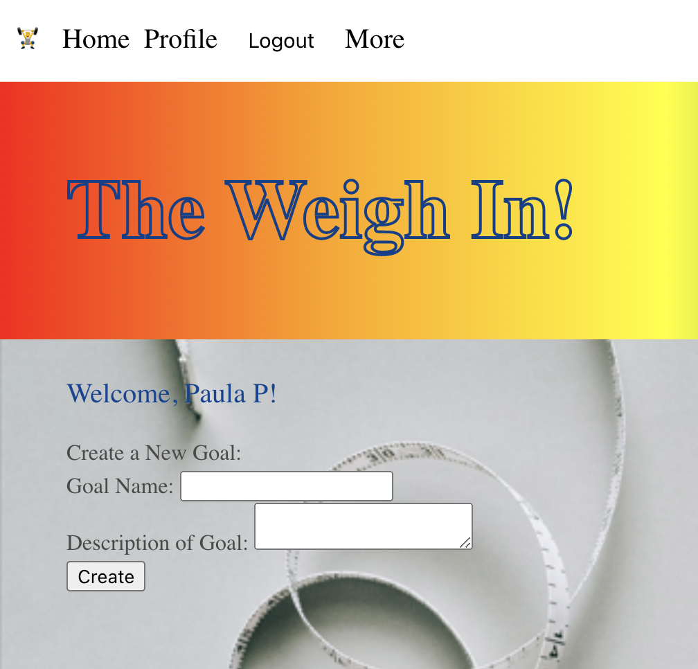
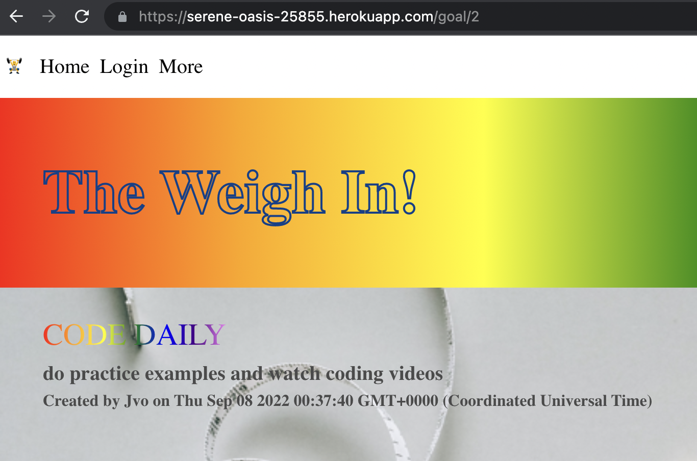

# Project 2// Group 1: Building An App with Node.js Express.js Handlebar.js MYSQL Sequelize ORM MVC paradigm authentication

Link to [The Weigh In Application]:(https://serene-oasis-25855.herokuapp.com/)
Presentation Slides: ()

# User Story for the Weighin

An user wants to be able to track their fitness goals. 
They can post their goals and make different goals to keep motivated. 
Make your goals and habits achievable by posting on the weighin!

## Criteria

**You will need to run this application in a browser.**

Technologies Used: Node.js, express.js, mysql, ORM, authentication and cookies, Handlebar.js, Sequelize, MVC paradigm

Login in to mysql

### Installation

**Run in the project root directory**
- npm init -y
- npm i
- npm start

### Assets
These are images of the working application.

#### Links
[Github Repository](https://github.com/pppreap/project2) 
///
[Link to theweighin](https://serene-oasis-25855.herokuapp.com/)

#### Credits
- MIT, Heroku, Github
- Michigan State University Full Stack Coding Camp
- Background Image: https://www.pexels.com/search/weight%20loss/
- BMI calculator: https://codepen.io/janez33/pen/BepwqE

